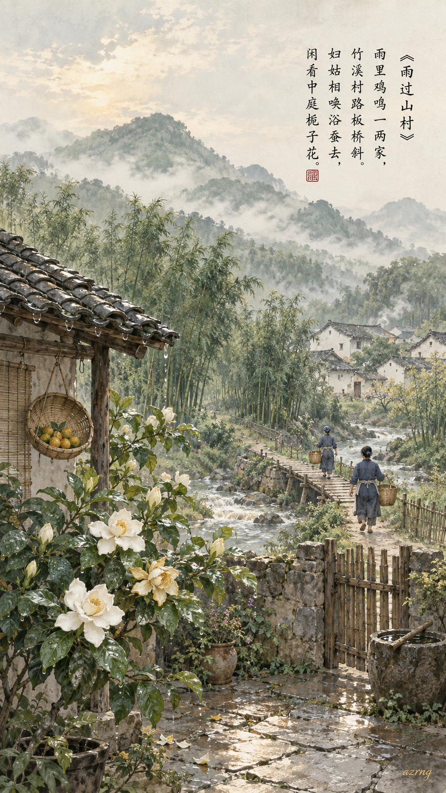
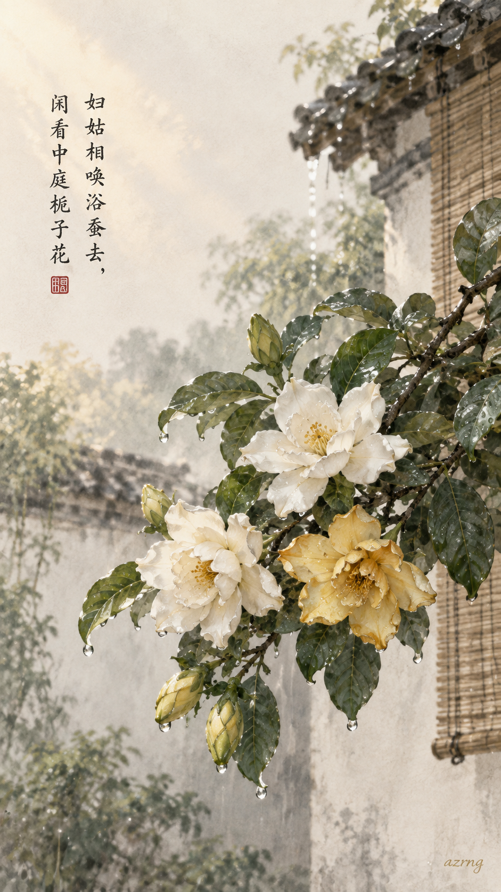
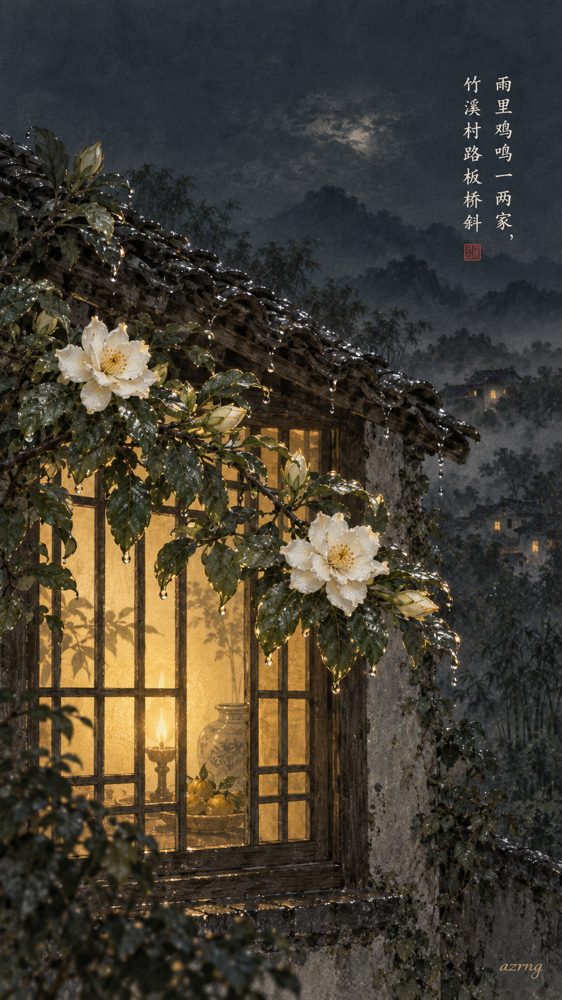
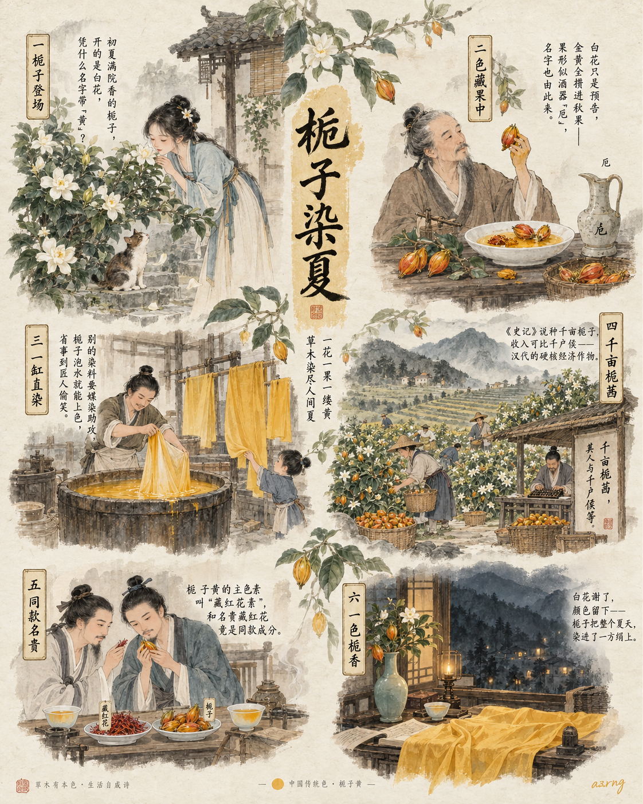
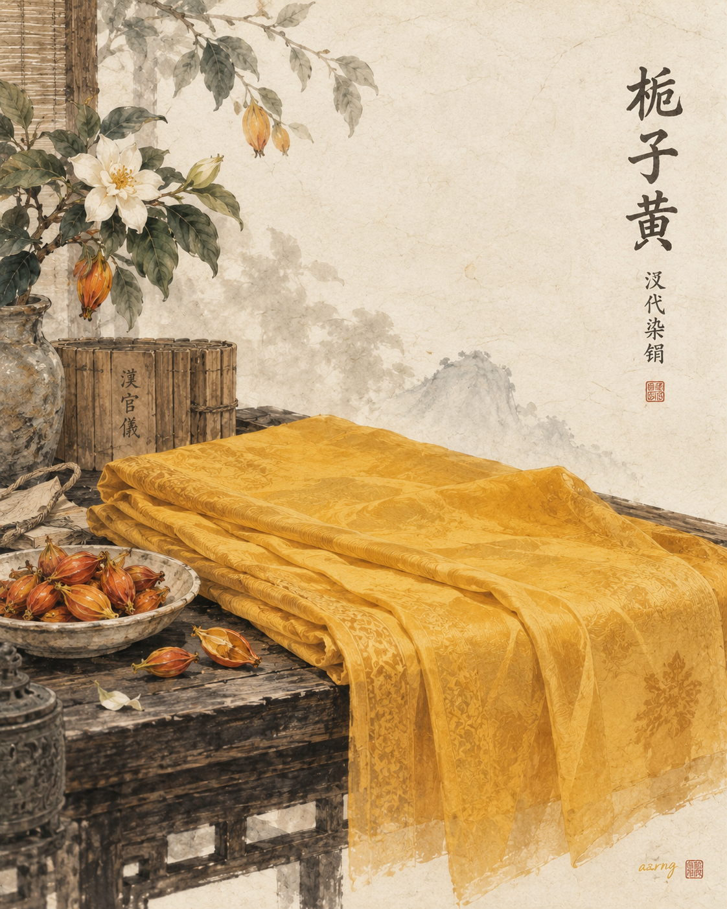
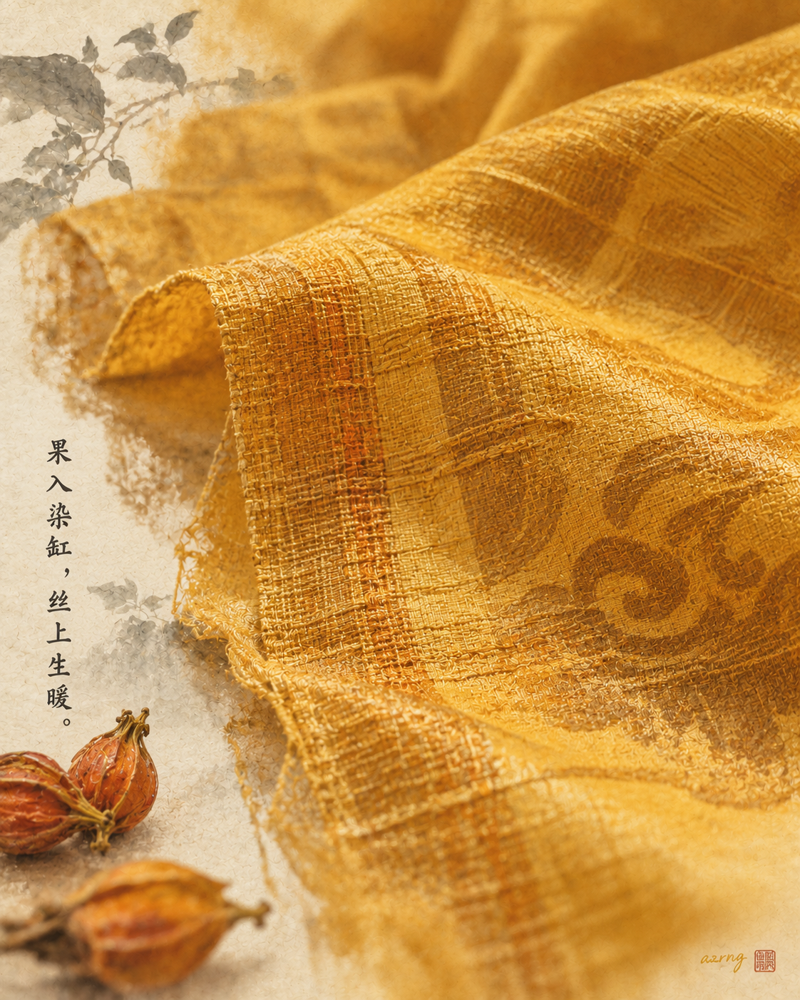
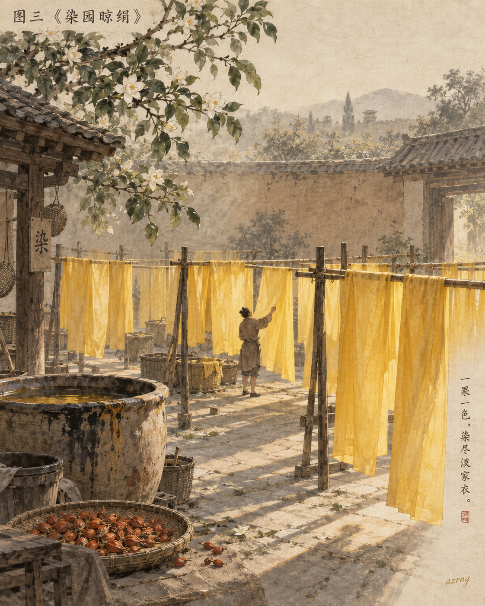

## 一色一诗

### 标题

《栀子黄 ×〈雨过山村〉｜闲看中庭栀子花》

### 正文

如果初夏的村庄有颜色，我想它是被雨水洗过的栀子黄。

栀子黄，取自栀子果实，是中国沿用千年的天然黄色染料。这一次，把它配给王建的《雨过山村》——"妇姑相唤浴蚕去，闲看中庭栀子花"。雨后山村，鸡鸣隐约，竹溪绕过斜斜的板桥，庭中栀子静静开着。这种暖黄并不浓烈，像天光落在湿瓦与花苞之间，有人间烟火的温度，也有农忙时节的从容与安宁。

三张壁纸：图一是雨后山村的完整诗境；图二只取中庭那一枝带雨的栀子；图三把时间挪到深夜，留一扇透着暖黄灯光的窗。

三张里，你更喜欢哪一种诗境？下一期，想看哪一种中国传统色？

\#中国传统色 #栀子黄 #古诗词 #国风壁纸 #手机壁纸 #东方美学 #雨过山村 #唐诗意境

## 一色一源

### 标题

中国传统色｜栀子黄的黄，藏在果子里

### 正文

栀子要是会说话，大概第一个不服："我明明开的是白花，怎么黄色记在我头上？"

其实古人看中的不是花，是果。夏初栀子开雪白的花，香满一院；入秋结出的果实里，攒着整个染色的秘密——成熟栀子果含天然黄色素，白绢往染液里一浸，就能得到一抹明亮温暖的蛋黄金，连媒染剂都省了。

它在汉代是写在史书里的"硬通货"：《史记·货殖列传》说"千亩栀茜，其人与千户侯等"，种上千亩栀子和茜草，收入可与千户侯比肩。连名字都有讲究，《本草纲目》解释，果实形似古酒器"卮"，"栀子"由此得名。

更妙的是，它的主要色素和名贵藏红花是同款（藏红花素），至今仍是常见的天然食用色素。古人的绢帛和点心，都见过这口金黄。

一株植物，把花香留给夏天，把黄色留给了绢帛。

如果让你给这抹金黄重新取个名字，你会叫它什么？

\#中国传统色 #栀子黄 #植物染 #国风插画 #东方美学 #传统色彩 #古人的生活 #国风美学

## 一色一物

### 标题

中国传统色｜栀子黄，染在汉家丝绢里

### 正文

有一种黄，长在枝头。栀子花开是白的，果子却藏着一汪金黄——秦汉以前，它是中原应用最广的黄色染料。

本期之物，是马王堆汉墓出土的黄色丝织品。《汉官仪》载"染园出栀、茜，供染御服"，研究指出，马王堆染织品中的黄色，正是以栀子染成。杜甫写栀子"于身色有用"，说的就是这件事。

植物染的黄，和色卡上的黄不一样。丝有光泽，绢有经纬，栀子的黄里还透着一点暖橙——迎光时明亮如新果，背光处沉淀成柔和的赭金，深深浅浅，随光线流动。这是任何一块纯色都给不出的层次。

而且栀子染黄不耐烈日，宋代以后渐渐被槐花替代 。所以在两千年后依然温润的这一抹黄，格外值得看一眼。

栀子黄从不是色卡上孤零零的一格，它曾是一整片染园、一缸热水、一匹晾在风里的绢。

下一期，你想看哪种颜色藏在哪件古物里？

\#中国传统色 #一色一物 #栀子黄 #植物染 #东方美学 #中国美学 #汉代丝织品 #博物馆美学