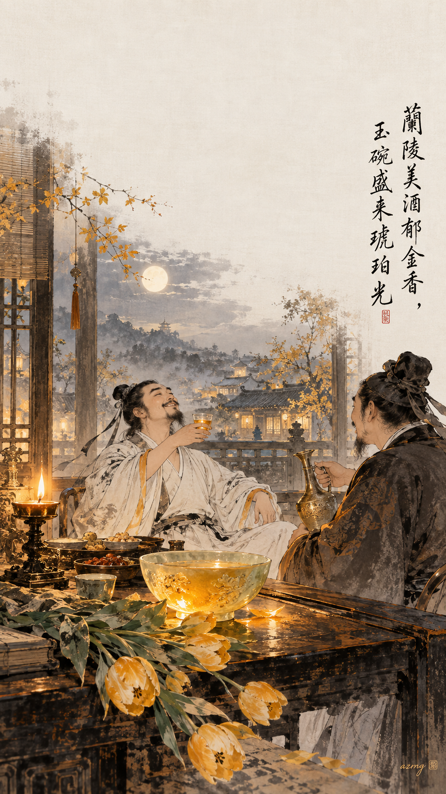
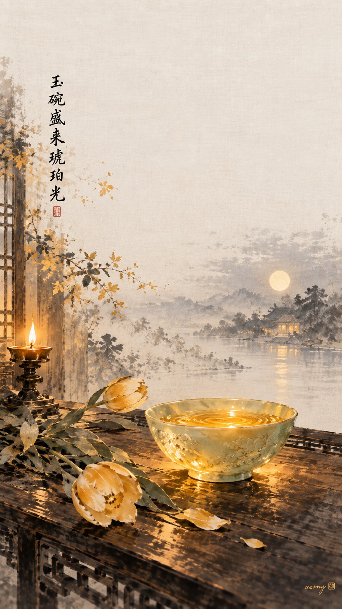
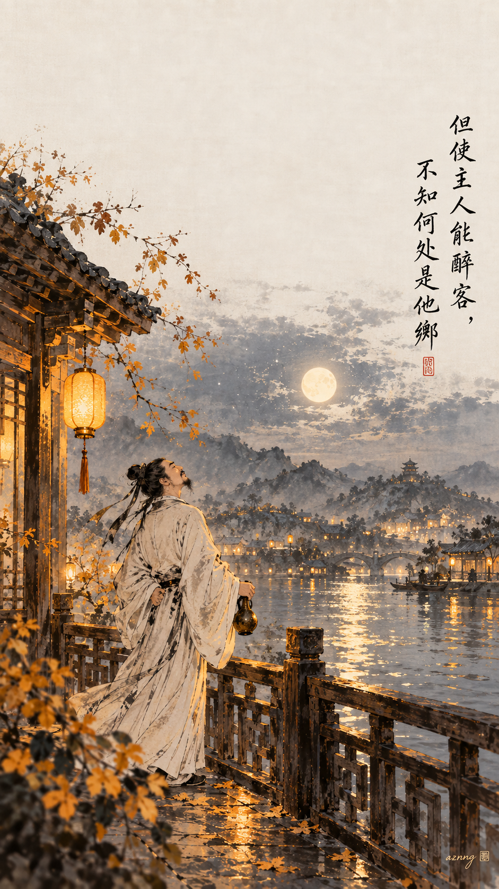
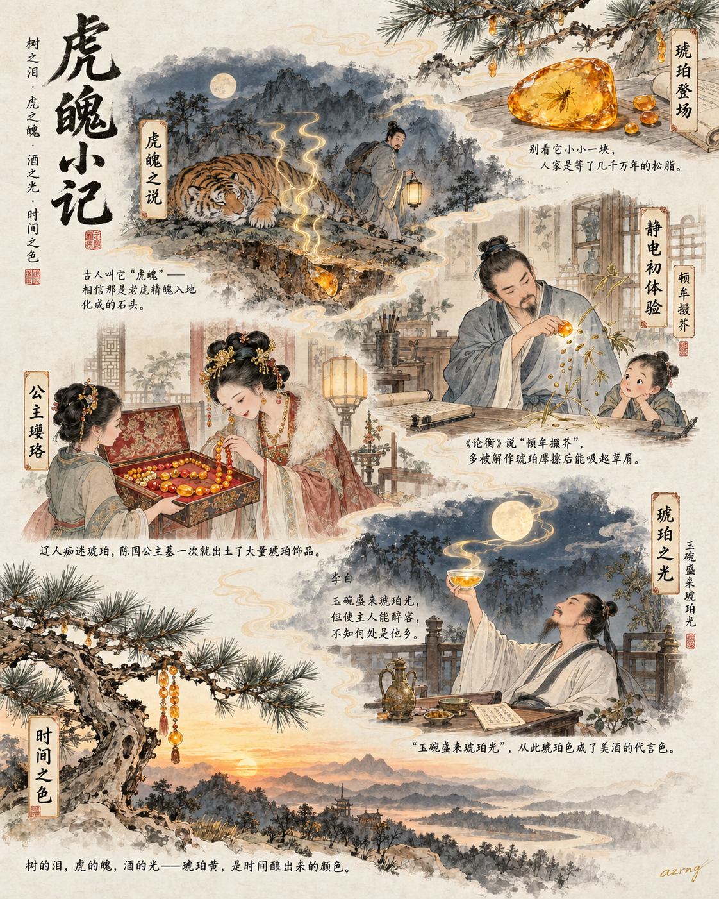
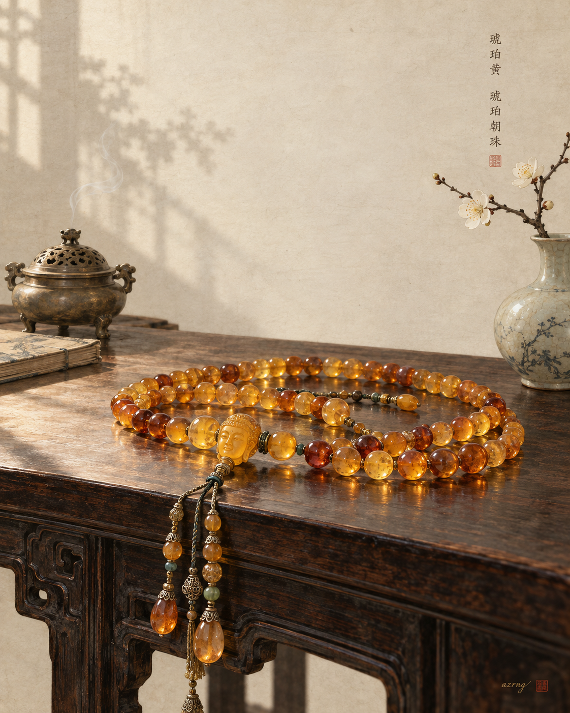
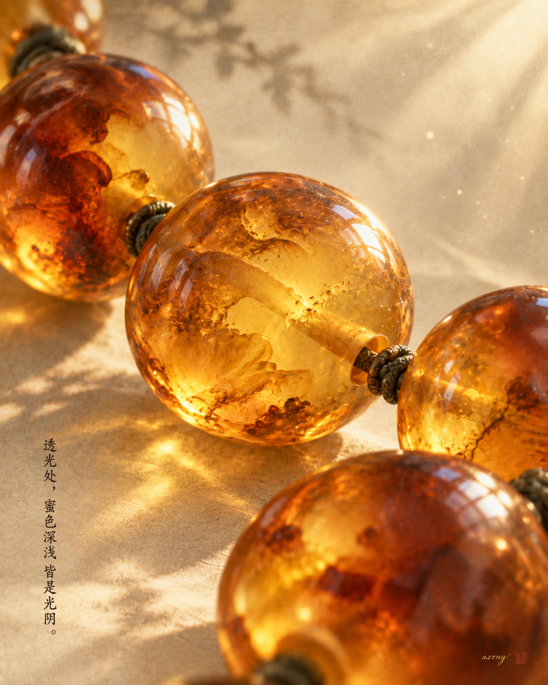
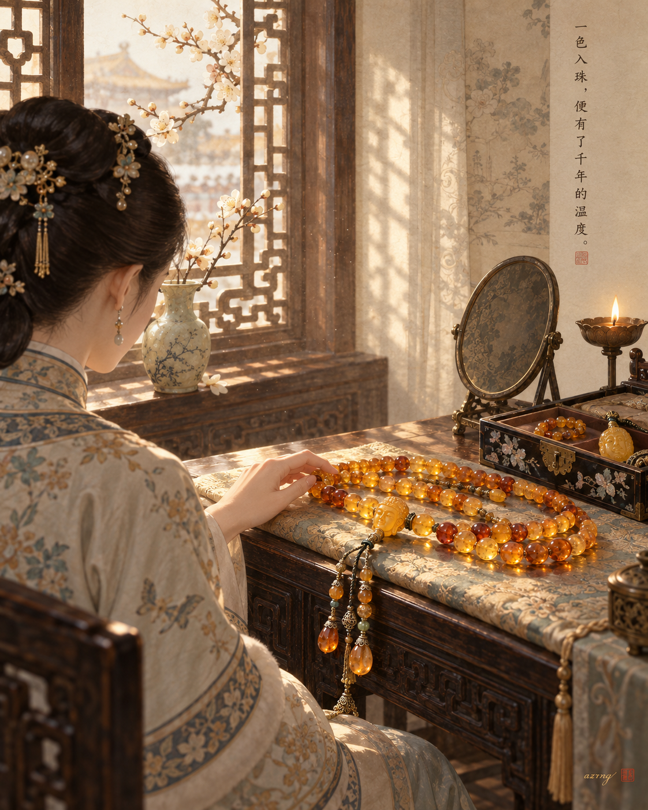

## 一色一诗

### 标题

中国传统色｜琥珀黄，斟进李白的《客中行》

### 正文

有一种黄，是可以入口的温热。

今天想用中国传统色「琥珀黄」，来盛李白的《客中行》，“兰陵美酒郁金香，玉碗盛来琥珀光。”这是一种介于蜜色与烛光之间的黄，不张扬，却有穿透寒夜的温度。它像玉碗里新斟的酒，像客舍烛火微微晃动的一圈光晕，也像他乡遇故知时，心里忽然亮起来的那一小块地方。

三张壁纸：图一是兰陵客舍的夜宴，烛光与酒香都还在；图二只画那一盏盛满琥珀光的玉碗，安安静静；图三画宴散之后，微醺的旅人立在月下，忽然觉得何处都不是他乡。

三张里，你更喜欢哪一种醉意？下一期想看哪种传统色，也可以告诉我。

#中国传统色 #琥珀黄 #古诗词 #李白 #客中行 #国风壁纸 #东方美学 #手机壁纸

## 一色一源

### 标题

中国传统色｜琥珀黄，古人竟以为它是老虎变的？

### 正文

说一个颜色，背后有老虎、静电和李白，你信吗？

琥珀黄，取自琥珀——几千万年前的树脂化石。透亮的金黄里偶尔还封着一只小虫，等于把时间本身做成了宝石。

它的名字更有意思。古人写作“虎魄”，李时珍《本草纲目》也记下过这种想象：虎死之后精魄入地，化而为石。所以在古人眼里，它一开始是带点敬畏的。

它还很“来电”。王充《论衡》里那句“顿牟掇芥”，多被解释为琥珀摩擦后能吸起草屑——两千年前，古人就体验过静电。

辽代人则把它当心头好，陈国公主墓出土的琥珀饰品多到惊人。

到了李白笔下，“玉碗盛来琥珀光”，这抹金黄又成了美酒的代言色。

互动一下：如果送你一块琥珀，你会做成首饰，还是换一碗“琥珀光”？

#中国传统色 #琥珀 #国风插画 #东方美学 #古人的浪漫 #博物志 #颜色名字的故事 #传统文化

## 一色一物

### 标题

中国传统色｜琥珀黄，一串朝珠里的千年暖光

### 正文

有些颜色，天生带着温度。琥珀黄就是。

它不是凭空调出来的颜色，而是一块树脂在地底沉睡千万年后，凝成的那种温润的黄。

本期「一色一物」，选了清代宫廷的琥珀朝珠。清宫珍玩中，蜜蜡与琥珀常被制成朝珠、佩饰与小件器物，深受皇家喜爱。李白写“玉碗盛来琥珀光”，早在唐代，人们就用琥珀形容最动人的光泽。

看琥珀，才真正懂这种黄：它不刺眼，是半透明的、流动的。光穿过珠体，会留下深浅不一的蜜色——浅处近鹅黄，深处近乎茶褐。千万年前树脂流淌的纹路，至今还封存在里面。

所以琥珀黄不是色卡上一格孤零零的黄，它曾是一串珠、一枚佩、一段被收藏起来的光。

下一期，你想看哪种颜色藏在哪件古物里？

#中国传统色 #一色一物 #琥珀 #琥珀黄 #东方美学 #中国美学 #文物 #古代艺术