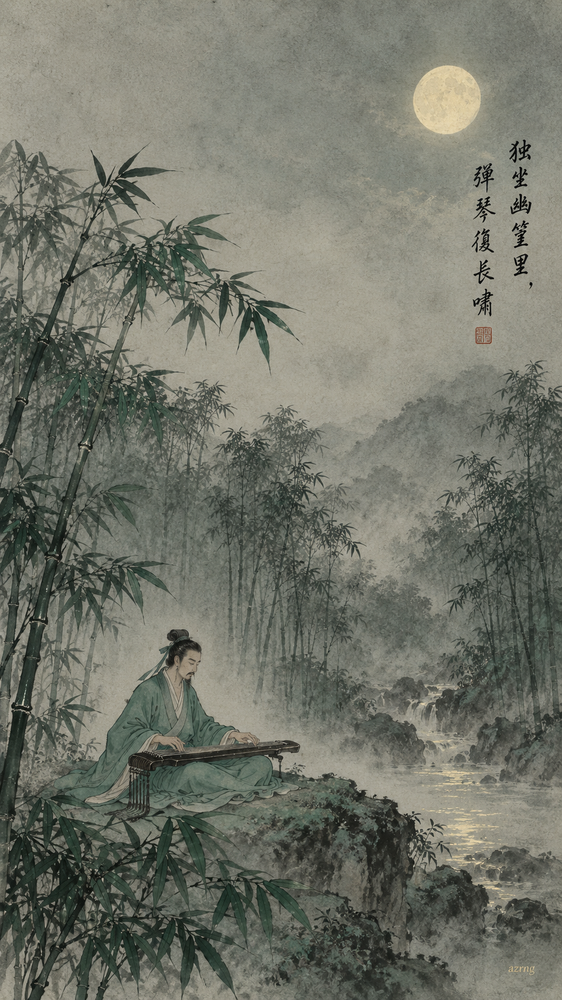
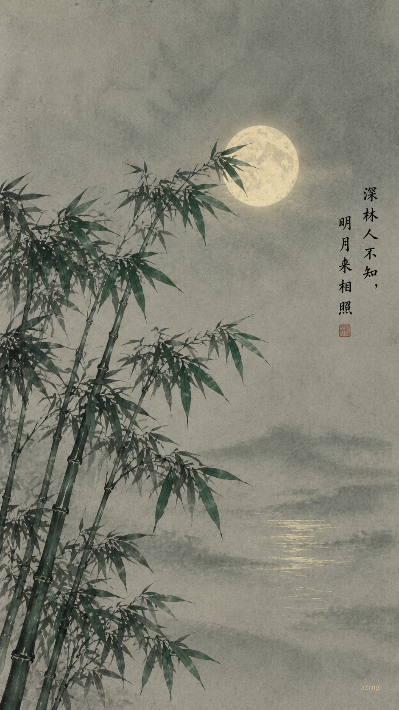
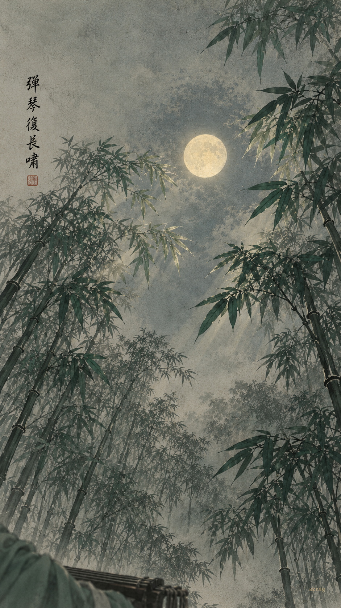
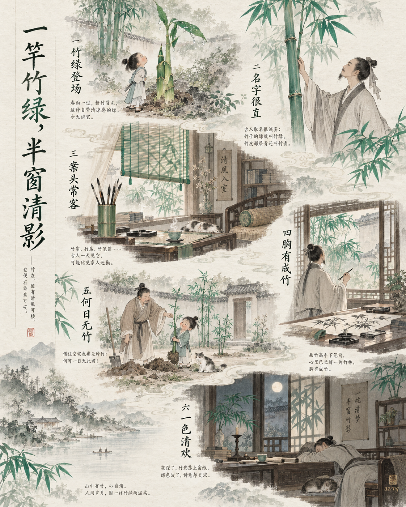
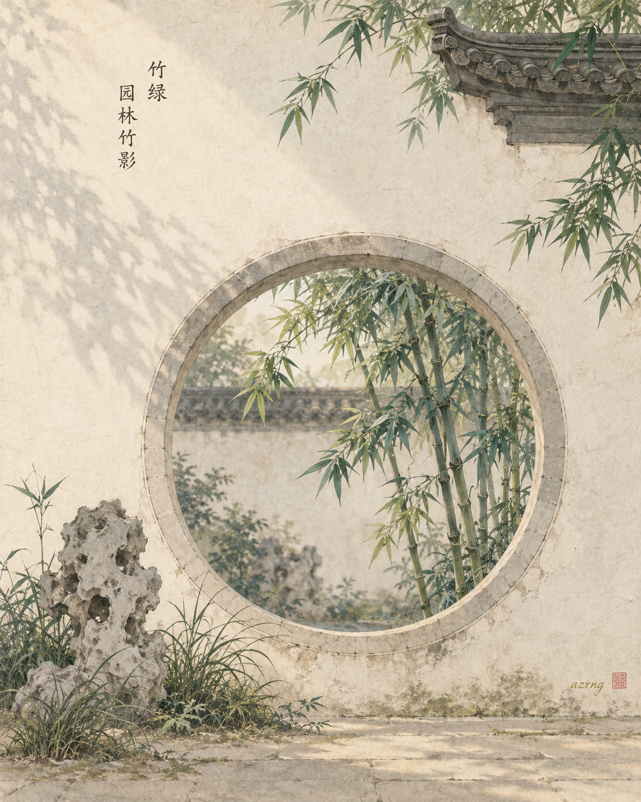
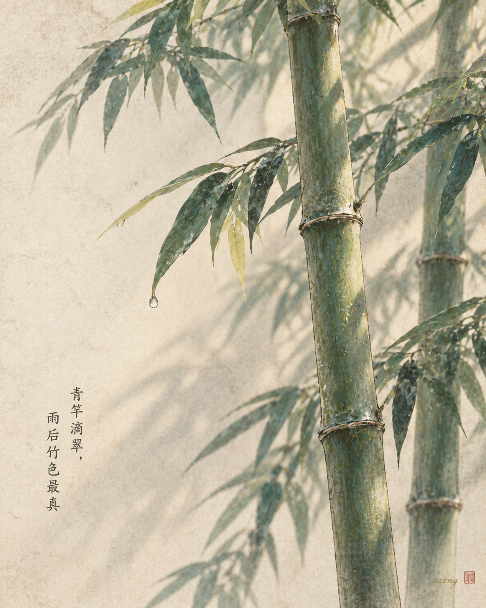
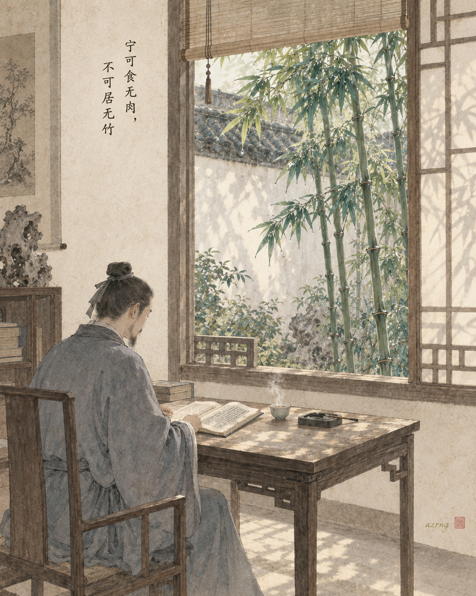

## 一色一诗

### 标题

竹绿 ×《竹里馆》｜明月来相照

### 正文

如果《竹里馆》有颜色，我想它不是春日喧闹的新绿，而是月下幽篁深处，清清冷冷的一点竹绿。

独坐幽篁里，弹琴复长啸。
深林人不知，明月来相照。

竹绿介于青与翠之间，安静自持，不争不抢，正合这首诗的气质：一个人的竹林，一张琴，一轮月。无人知晓，也不必人知，天地间自有明月来做知己。

三张壁纸，三种幽篁月色：
图一，月下独坐、抚琴长啸的完整诗境；
图二，只取修竹与满月，极简留白；
图三，换个视角，从竹间仰望月轮，把孤独画成辽阔。

三张里，你更喜欢哪一种幽篁月色？下一期，想看哪一种中国传统色？

#中国传统色 #古诗词 #国风壁纸 #王维 #竹里馆 #竹绿 #东方美学 #手机壁纸

## 一色一源

### 标题

中国传统色｜竹绿，让文人走不动路的颜色

### 正文

古人对绿的最高级理解，可能就藏在一竿竹子里。

苏东坡写过“不可居无竹”，可见文人对竹有多执念。竹绿，常被认为是新竹枝叶间那层清新挺拔的绿——比嫩草多一分气节，比松针多一分水润。

它长在山间，也住进书房：竹帘筛下的光斑、案头的竹笔筒、纸上的墨竹……可以说，古人的一天，是被竹绿温柔包围的一天。

颜色取自自然，名字也起得朴素可爱：竹子的绿，就叫竹绿。

如果让你给这个颜色重新取个名字，你会叫它什么？评论区聊聊👇

#中国传统色 #竹绿 #国风插画 #东方美学 #传统文化 #颜色里的中国 #水墨插画 #古人的浪漫

## 一色一物

### 标题

中国传统色｜竹绿，藏在一扇江南花窗后

### 正文

竹绿，不是调出来的绿，是长出来的绿。

要真正认识它，得去江南园林走一趟——粉墙、黛瓦、花窗，窗外必有竹。竹是文人亲手种下的"君子"，苏东坡说"宁可食无肉，不可居无竹"；扬州个园，干脆取半个"竹"字为名，园中植竹万竿。

竹绿妙在层次：新篁嫩得偏黄，老竹沉入墨青；雨后叶尖泛着一层釉光，日光斜穿漏窗，绿便深一块、浅一块地落在白墙上。一面粉墙，正是古人为这抹绿备下的画纸。

所以竹绿从不是色卡上孤零零的一块颜色——它被中国人种进院子、裁进花窗，活成了日常。

下一期，你想看哪一种颜色藏在哪件古物里？

#中国传统色 #一色一物 #竹绿 #东方美学 #江南园林 #文人雅趣 #国风插画 #传统色彩之美