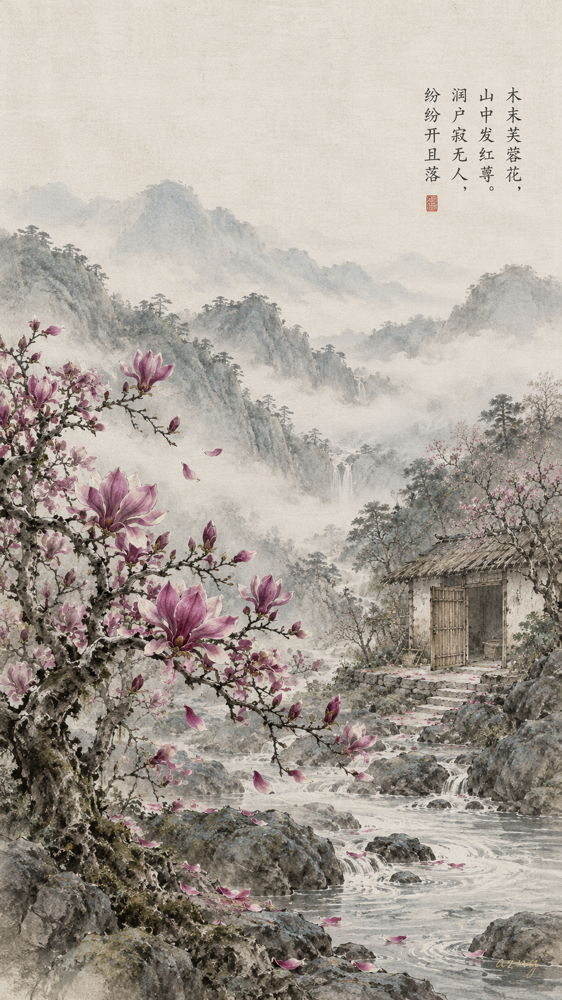
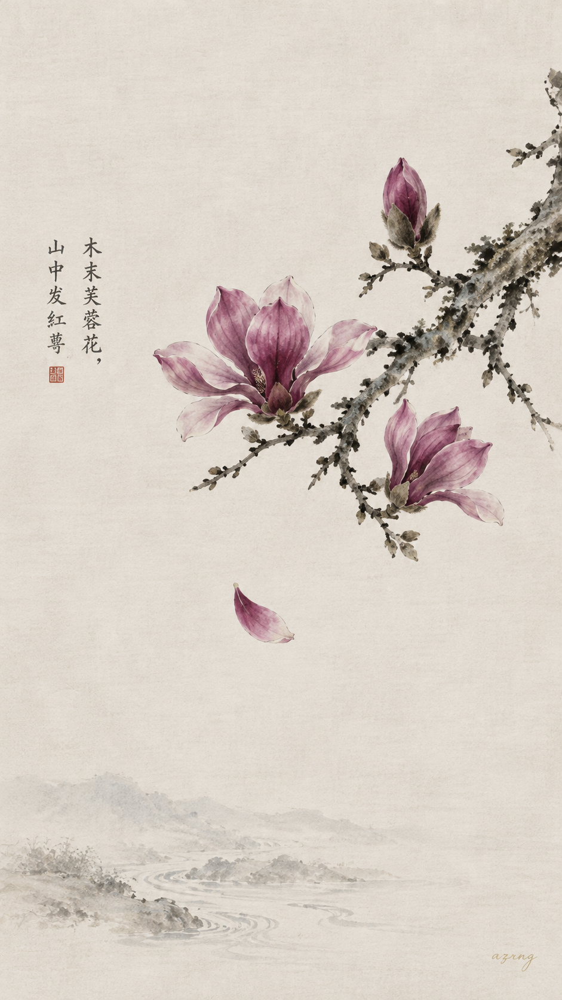
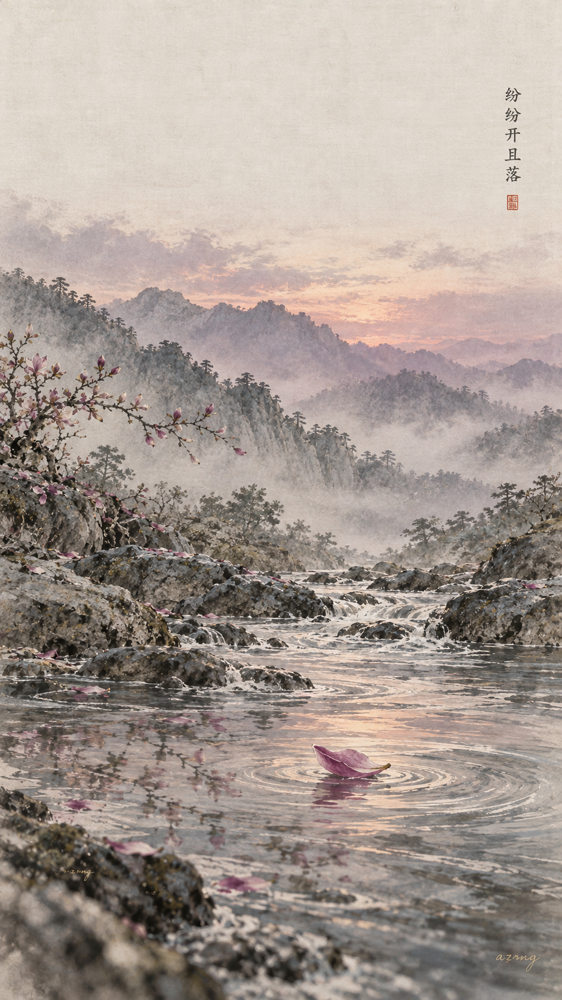
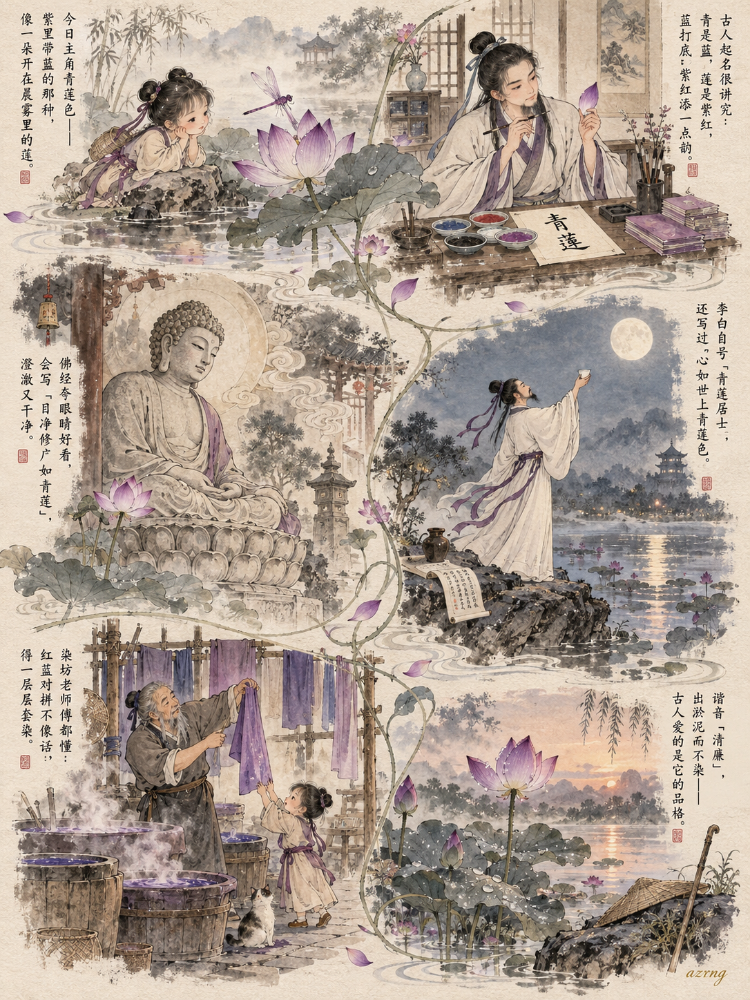
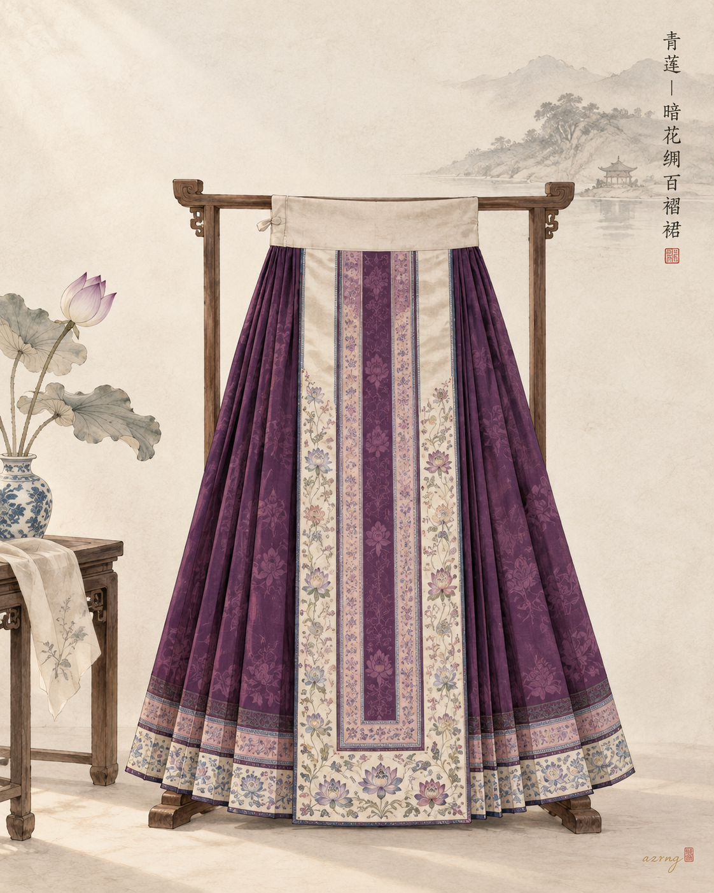
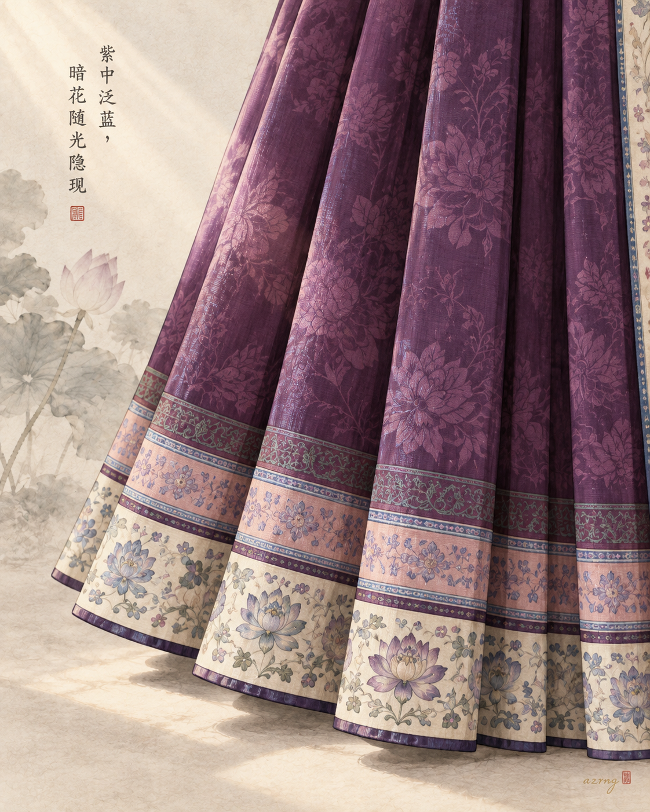
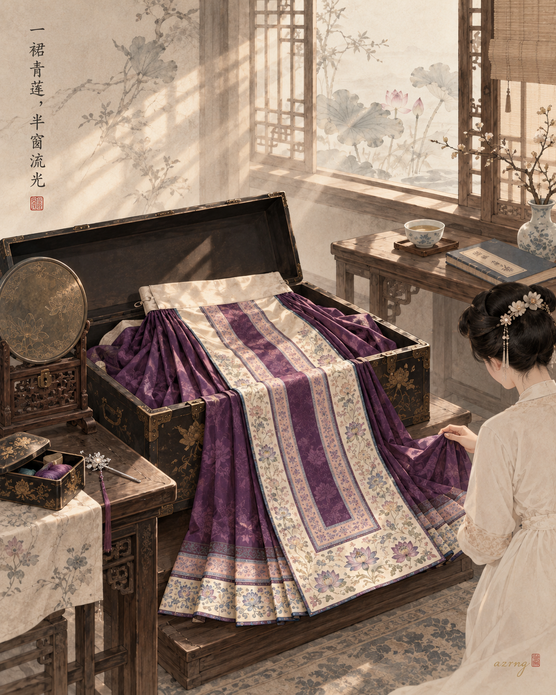

## 一色一诗

### 标题

中国传统色｜青莲落进王维的空山里

### 正文

有些花开，不为任何人看。

王维的《辛夷坞》就是这样：木末芙蓉花，山中发红萼。涧户寂无人，纷纷开且落。深山无人处一树辛夷，自开自落，安静得近乎禅意。

今天的传统色是青莲（#8B2671），介于紫与红之间，比紫暖，比红沉。它正是辛夷开在枝梢的颜色——空寂山谷里唯一的声色，越静，越显。

三张壁纸：图一是完整诗境，空山、涧户、一树青莲自开自落；图二只取枝头三两朵，大面积留白，让颜色自己说话；图三把时间挪到暮色，一枚落瓣随涧水漂远，替那句「纷纷开且落」收了尾。

三张里，你更喜欢哪一种山中的安静？下一期想看哪一种传统色？

#中国传统色 #古诗词 #国风壁纸 #东方美学 #手机壁纸 #王维 #辛夷坞 #青莲色

## 一色一源

### 标题

中国传统色｜青莲明明偏紫，为什么名字里带个“青”？

### 正文

有一种紫色，名字里偏偏带个“青”字，李白还把它刻进了自己的名号——青莲色。

它紫中带蓝，像晨雾里将开未开的一朵莲。《说文解字》里“青”多为蓝，莲色近紫红，青为主、莲为辅，便成了这抹沉静的蓝紫。

佛经用它形容佛眼：“目净修广如青莲”，澄澈干净；李白自号“青莲居士”，写下“心如世上青莲色”；青莲又谐音“清廉”，配上“出淤泥而不染”，古人爱它，一半是颜色，一半是品格。

有意思的是，老染坊里的青莲色不靠红蓝对拼，而是一层一层套染出来的。清末光绪年间，它还曾是王公贵族衣上的流行色。

一朵莲，一种色，一颗心。

如果让你给青莲色重新取个名字，你会叫它什么？评论区聊聊～

#中国传统色 #青莲 #国风插画 #东方美学 #传统色彩 #水墨小画 #古人美学 #颜色科普

## 一色一物

### 标题

中国传统色｜青莲，藏在一条晚清百褶裙里

### 正文

青莲，不是青，也不是正紫。

它是蓝紫之间透出的一点绛意，像莲花将开未开时，最沉的那一瓣。

本期之物，是一条晚清的青莲色暗花绸百褶裙。光绪年间，这抹紫蓝正流行于王公贵族的衣上；晚清留存下来的裙装中，就有以青莲色暗花绸为地、细褶如扇的百褶裙 [1]。

要真正看懂青莲，得看它落在丝绸上的样子。缎面受光处泛出蓝紫，褶裥阴影里沉入绛红，同色的缠枝莲暗花随光隐现——同一块料子上，青莲有千百种深浅。

李白号青莲居士，写过「心如世上青莲色」；青莲又谐音「清廉」，佛经里还以它形容佛眼的澄净 [1]。一种颜色，既是衣色，也是心色。

所以青莲从来不是色卡上孤零零的一格，它曾在晚清女子的裙裾上，随步履流光。

下一期，你想看哪一种颜色，藏在哪件古物里？

#中国传统色 #一色一物 #青莲色 #东方美学 #传统服饰 #晚清百褶裙 #中国古代服饰 #中国美学