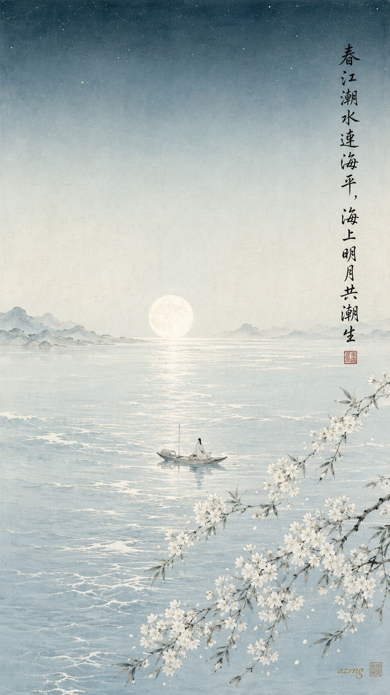
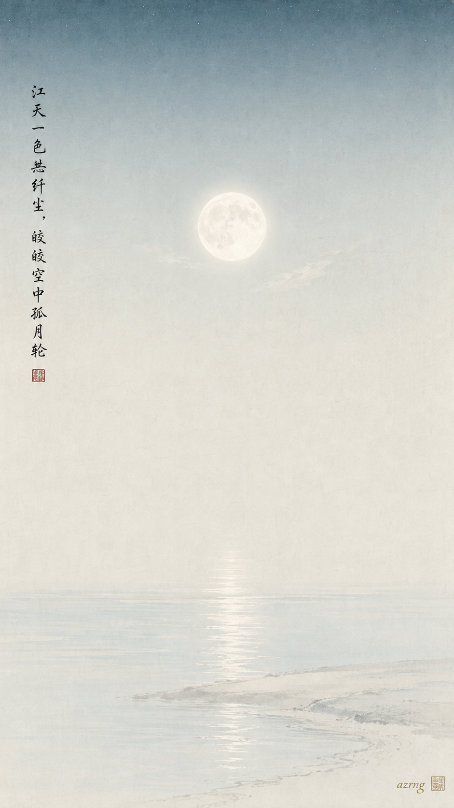
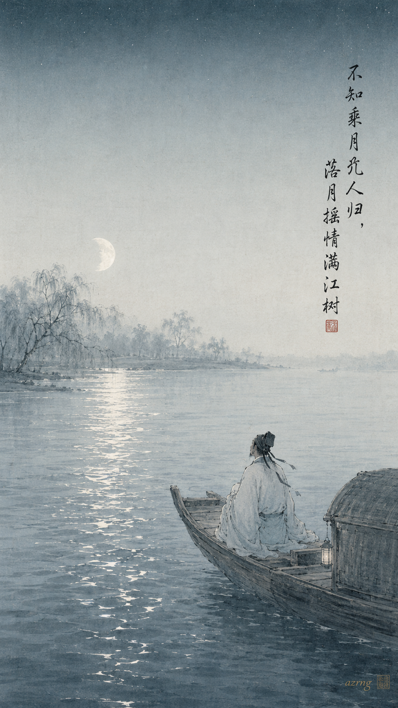
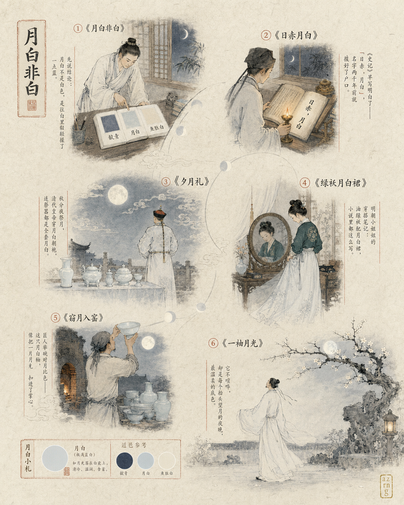
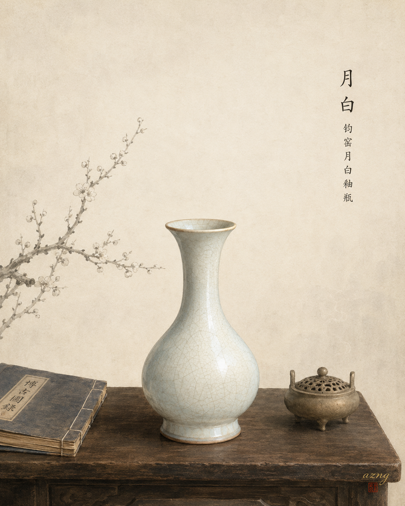
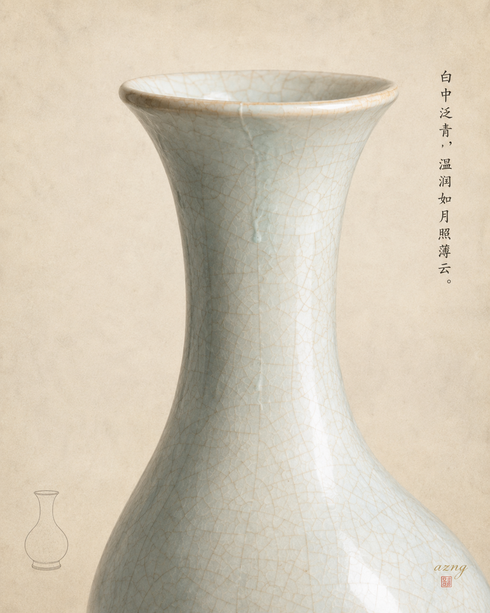
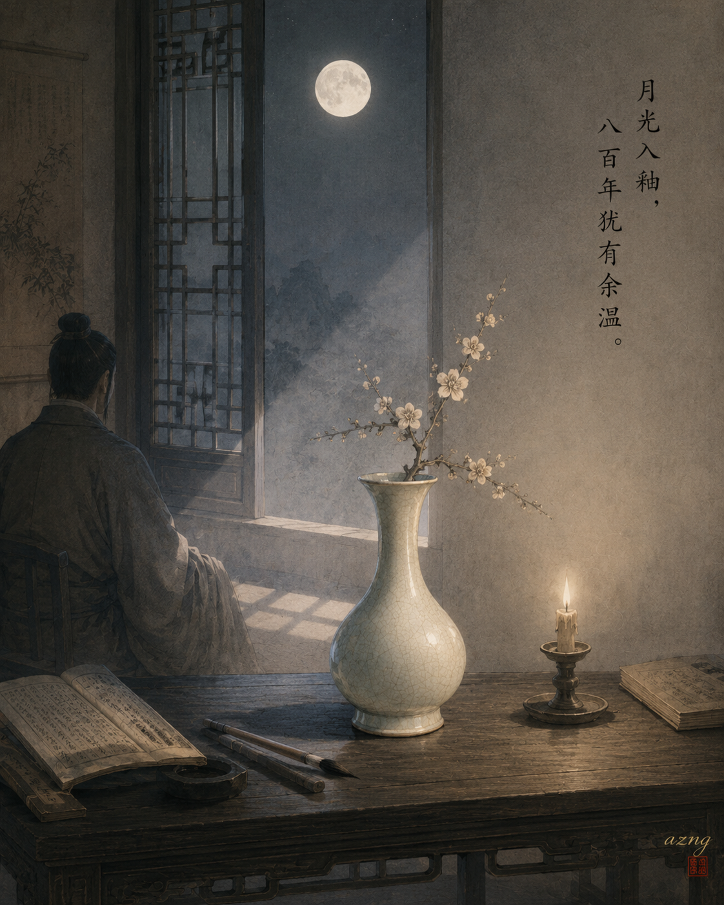

## 一色一诗

### 标题

《中国传统色｜月白，落进〈春江花月夜〉里》

### 正文

如果月光有名字，古人大概会叫它——月白。

月白不是纯白，白里藏着极淡的一缕青，像子夜的天空刚被月光轻轻洗过。这一次，把它交给《春江花月夜》最合适："江天一色无纤尘，皎皎空中孤月轮"，月色漫过春江，把水、雾、花林与沙汀，都染成同一种安静清冷的颜色。

三张壁纸，三种月色：图一是潮平月升的完整春江夜；图二只留一轮孤月与无尘江天；图三沉入夜将尽时，落月摇情，独坐舟头的人还未归。

哪一种月色，是你想留在锁屏上的春天？

\#中国传统色 #月白 #春江花月夜 #张若虚 #古诗词 #国风壁纸 #东方美学 #手机壁纸

## 一色一源

### 标题

中国传统色｜月白，其实根本不是白色

### 正文

如果你的第一反应是"月白＝白"，那今天要刷新一下认知——月白，其实是一种很浅很浅的蓝，浅到像月光轻轻落在宣纸上[2](https://baike.baidu.com/item/月白色/3081083)。

这个名字来头不小。《史记·封禅书》里就写着"五帝各如其色，日赤，月白"——太阳赤色，月亮月白，古人取名直接和日月对表[2](https://baike.baidu.com/item/月白色/3081083)。到了清代，讲究程度再升级：皇帝秋分夜到月坛祭月，身上穿的是月白朝袍，连祭器都要全套月白配色[2](https://baike.baidu.com/item/月白色/3081083)。民间也没闲着，明代小说里常见"油绿袄配月白裙"的流行穿法[2](https://baike.baidu.com/item/月白色/3081083)，文人珍爱的笺纸、窑里烧出的瓷器上，都能找到这种颜色[2](https://baike.baidu.com/item/月白色/3081083)。

它大概是传统色里最安静的一种：不争不抢，抬头就能看见。

如果让你给这种"月光色"重新取个名字，你会叫它什么？评论区聊聊，顺便点一个你想看的下期颜色～

\#中国传统色 #月白 #东方美学 #传统色彩 #国风插画 #古人生活美学 #水墨插画 #颜色冷知识

## 一色一物

### 标题

中国传统色｜月白，藏在一只宋瓶里的月光

### 正文

月白，不是白。 是月亮升起来那一刻，白瓷、白绢上浮起的那一丝淡淡蓝意 [2](https://baike.baidu.com/item/月白/80062)。

这一期的主角，是一件宋金时期的钧窑瓶。 钧窑的乳浊釉里，有一路釉色，就叫月白——白中泛青、温润失透，像月光凝在了瓷面上 [2](https://baike.baidu.com/item/月白/80062)。

它的妙处，在于"似有若无"。 釉厚处偏青，釉薄处近白，光一转，颜色便悄悄换了一层。 这种白，色卡印不出来，得站在一只古瓶前，慢慢看。

古人说"日赤，月白"，《天工开物》里又记，月白要"靛水微染"才能得 [1](https://chinesecoloratlas.com/zh-Hans/color/yue-bai)[2](https://baike.baidu.com/item/月白/80062)。 所以月白从不是一个孤零零的名字——它在瓷上、绢上，在中国人抬头望月的那一眼里。

下一期，你想看哪种颜色，藏在哪件古物里？

\#中国传统色 #一色一物 #月白 #钧窑 #宋瓷 #东方美学 #中国美学 #文物里的中国色