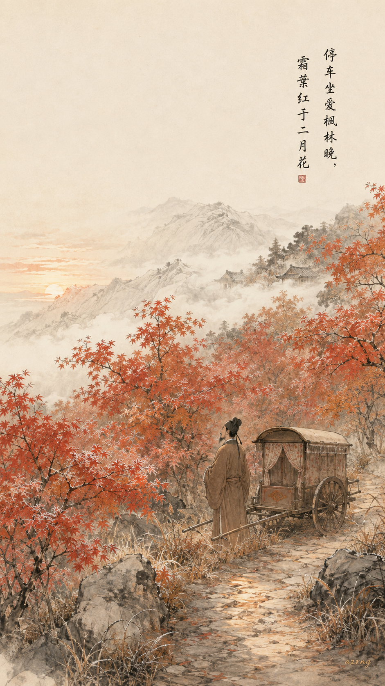
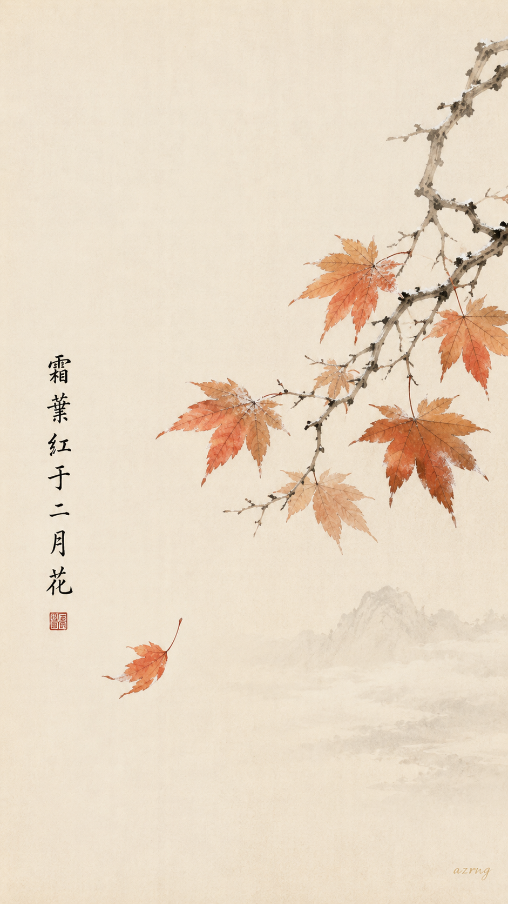
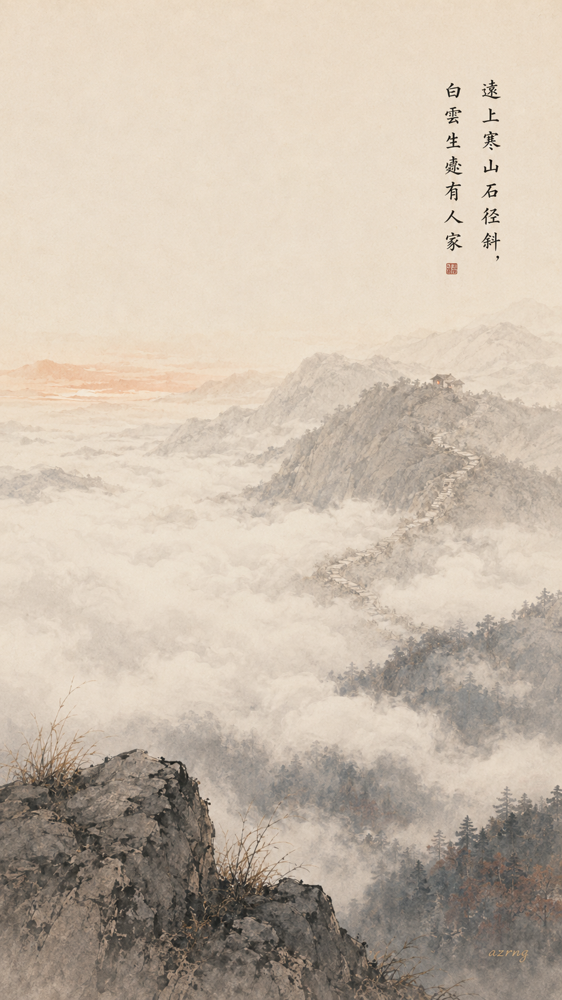
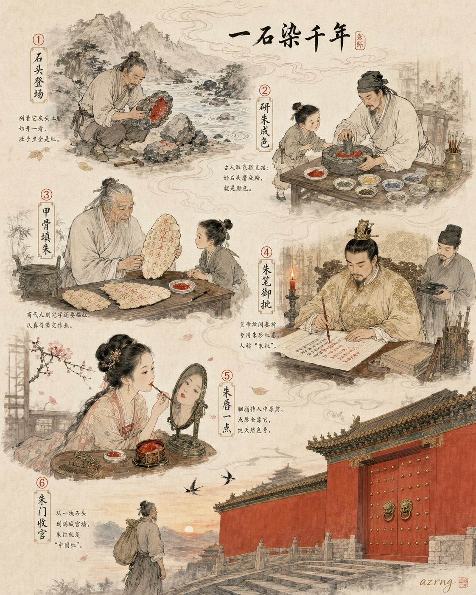
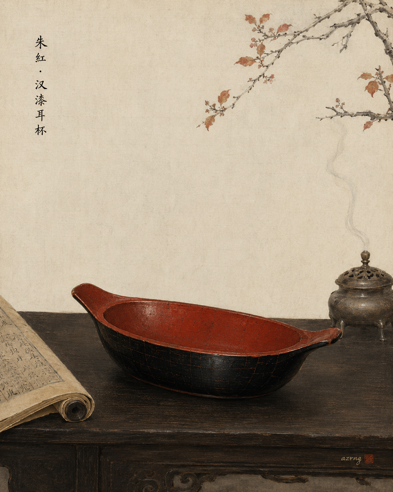
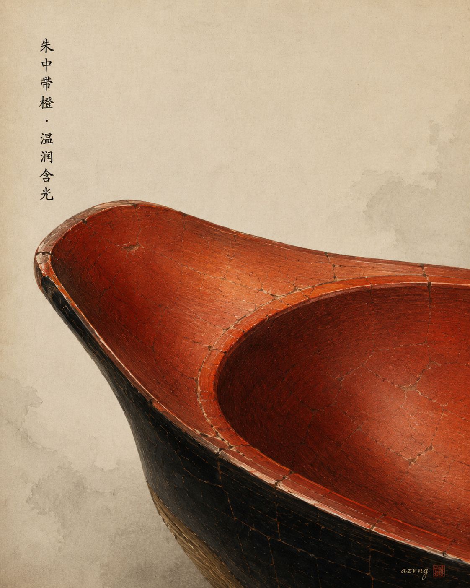
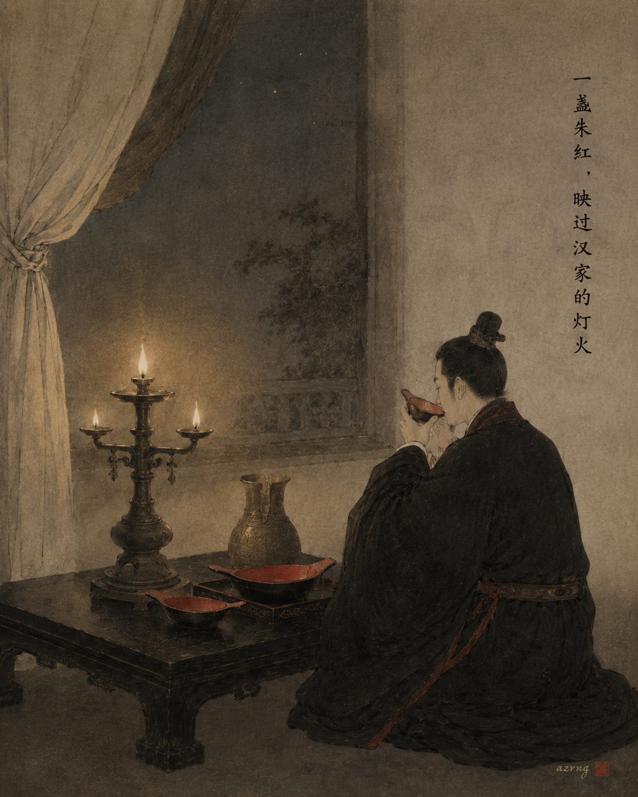

## 一色一诗

### 标题

《中国传统色｜朱红落进〈山行〉》

### 正文

如果深秋有一支笔，它蘸的一定是朱红。

今日用朱红（#ED5126）配杜牧的《山行》。这是一种从朱砂里走出来的暖红，橙中带棕，比正红多了几分向晚的温度——正是寒山日暮、霜叶被夕照点透的那一种颜色。所谓「霜叶红于二月花」，秋色燃过春花，也许就是这个颜色最好的注脚。

三张壁纸：图一是「停车坐爱枫林晚」的经典诗境，车驻枫林，人在晚照里；图二只凝视一片霜叶，留白更多，朱红更醒；图三换了视角，远眺白云生处，寒山深处一点人家的灯火。

三张里，你更喜欢哪一种秋意？下一期，想看哪一种传统色？

#中国传统色 #朱红 #古诗词 #山行 #杜牧 #国风壁纸 #东方美学 #手机壁纸

## 一色一源

### 标题

中国传统色｜朱红：一块矿石，红了几千年

### 正文

古人的红，从来不是随便红的。

朱红，是中国传统色里最古老的红之一，来自一种叫朱砂的矿物。它介于红与橙之间，明亮饱满，还泛着一点金属光泽——毕竟是石头里长出来的颜色。

早在商代，人们就把朱砂粉填进甲骨文的刻痕里，字字醒目；后来，皇帝批阅奏折的“朱批”用的也是它；胭脂传入中原之前，女子点唇的“口红”，还是它。最后，它干脆涂上了宫墙和朱门，成了最中国的红——因为真正的朱砂主产自中国，西方干脆称它为“中国红”。

一块石头，热热闹闹撑起了中国人几千年的仪式感。

你觉得朱红和今天说的大红色，是同一种红吗？

\#中国传统色 #朱红 #东方美学 #国风插画 #传统文化 #古人生活美学 #中国传统色卡 #国色之美 #颜色冷知识

## 一色一物

### 标题

中国传统色｜朱红，盛在一只汉代的杯子里

### 正文

有些颜色，单看色卡是记不住的。朱红就是这样——它不是一块平面的红，而是一种会发光、有深浅、有温度的红。

认识它最好的方式，是去看一枚汉代的漆耳杯。汉代人宴饮用耳杯盛酒，又称"羽觞"。长沙马王堆汉墓曾一次出土百余件漆器，其中不少是写着"君幸酒"的朱漆耳杯——红与黑，是那个时代最庄重的配色。

朱红之所以耐看，在于它是颜料与漆共同成就的红。朱砂调入大漆，一遍遍髹在木胎上，漆层深处透出微微偏暖的光泽，比色卡上的正红更沉着，也更温润。千年过去，漆色依旧鲜亮如初。

所以朱红从来不是色卡里孤零零的一块颜色，它盛过酒，映过灯火，活在中国人的席面上。

下一期，你想看哪种颜色藏在哪件古物里？

\#中国传统色 #一色一物 #朱红 #汉代漆器 #马王堆 #东方美学 #中国美学 #文物