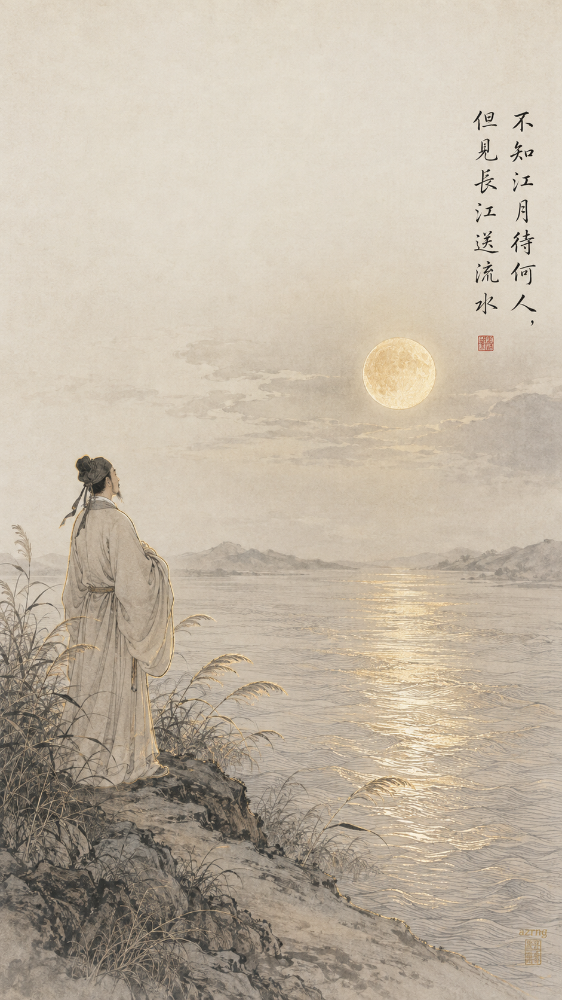
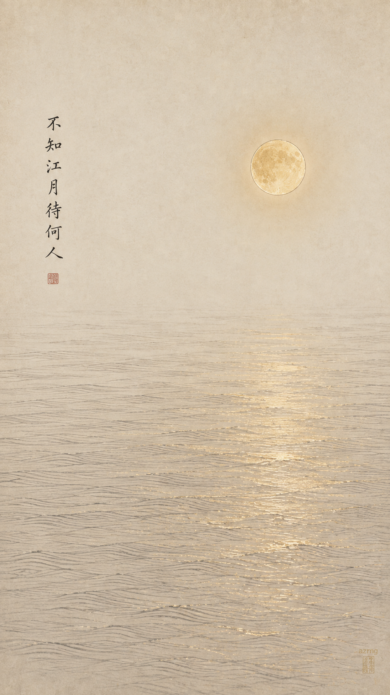
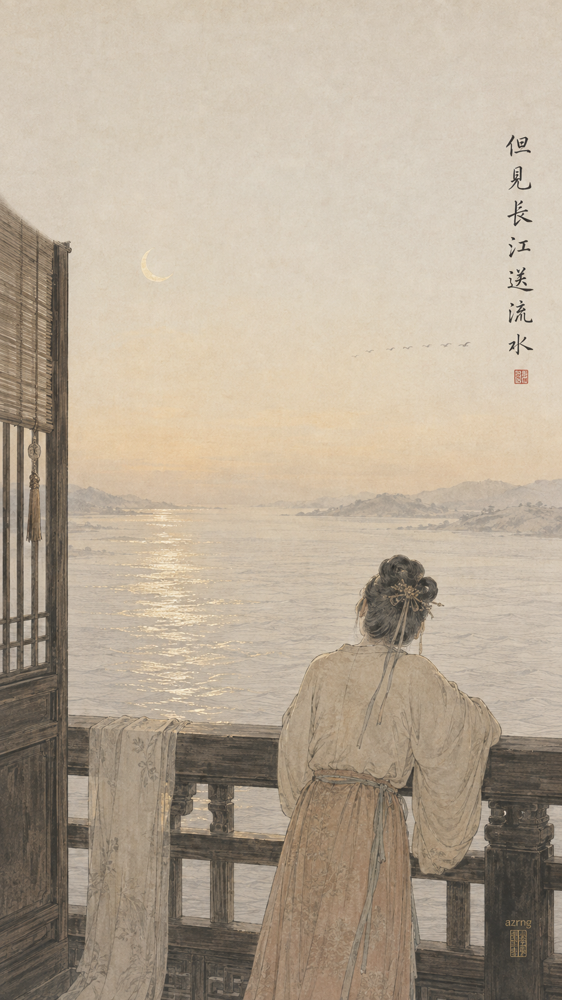
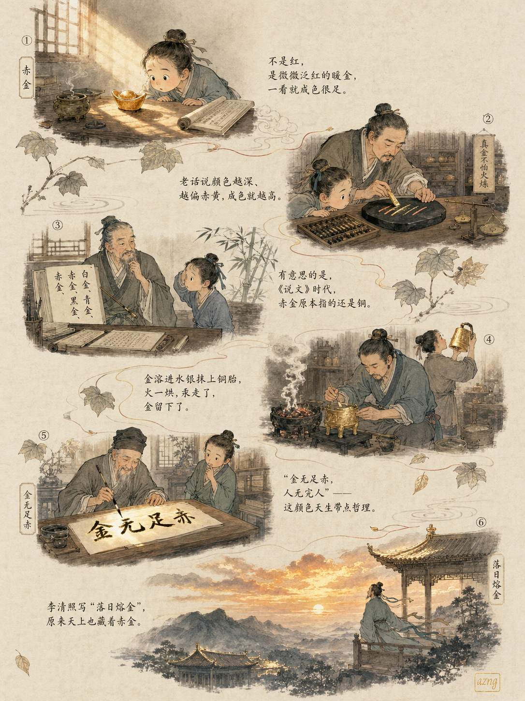
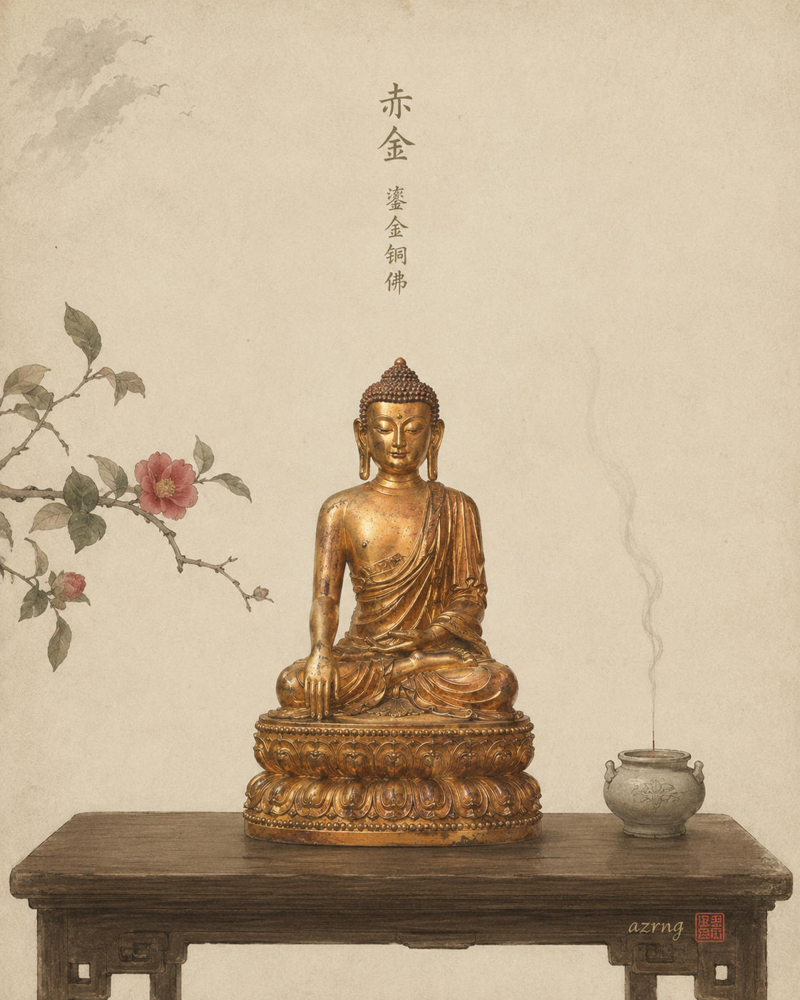
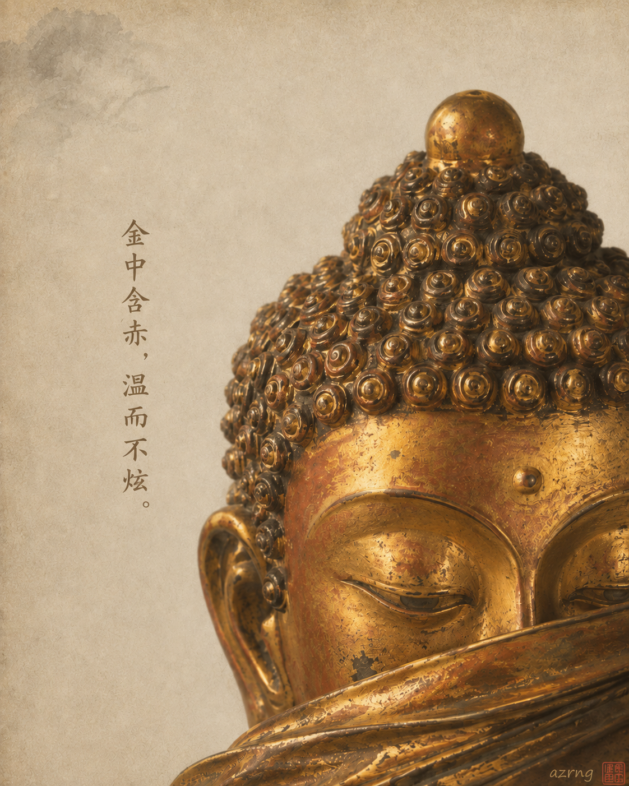
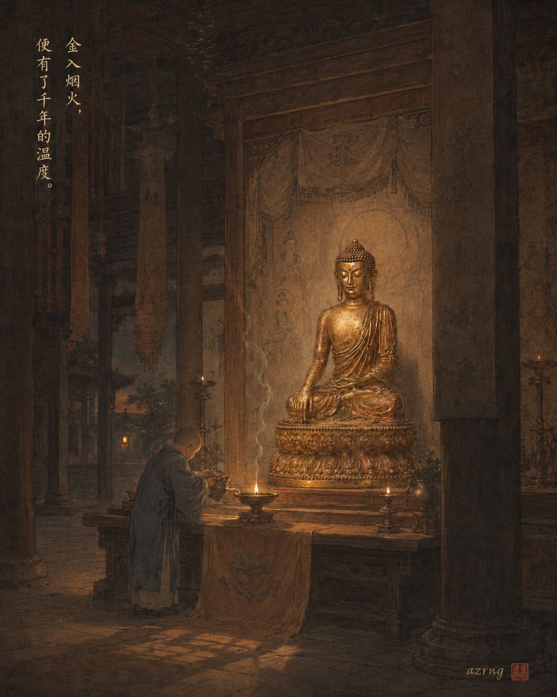

## 一色一诗

### 标题

《中国传统色｜赤金落进〈春江花月夜〉》

### 正文

如果《春江花月夜》真的有颜色，我想不会是冷白的月光，而是赤金——明月悬在春江之上，清辉洒进千万里水波时，微微泛起的那一层暖金。

赤金，介于朱红与鎏金之间，像旧铜器上最温润的一道光。它与「不知江月待何人，但见长江送流水」恰好相合：月是永恒的等待，水是不停的流逝，而赤金，正是这份等待被漫长夜色慢慢焐暖的颜色。

三张壁纸—— 图一：春江月夜的完整长卷，孤月中天，一人临江静立； 图二：只取一轮明月与滟滟金波，极简留白，看月如何「等」一个人； 图三：换一个视角，月落之前的江楼，凭栏望水，雁影远去。

三张里，你更喜欢哪一种月色？

\#中国传统色 #春江花月夜 #张若虚 #古诗词 #国风壁纸 #东方美学 #手机壁纸 #赤金

## 一色一源

### 标题

中国传统色｜“赤金”的前身，居然不是黄金？

### 正文

如果你的金饰穿越回宋代，老板可能会点头夸一句：好赤金。

有意思的是，“赤金”的前身并不是黄金——《说文》的五色金属里，赤金指铜，青金指铅，白金指银（南朝江淹还写过“赤金是铜”）。宋代以后，它才渐渐成为高纯度黄金的代称，颜色越深越偏赤，成色越足，才有了“金无足赤”这句老话。民国时各地标准还不同：天津99.6%、上海99.4%、北京99.2%，同叫赤金，各有各的“足”[1](https://baike.baidu.com/item/赤金/9833927)。

作为颜色，赤金是微微泛红的暖金：像鎏金铜器在灯下的温润，像《红楼梦》里黛玉头上那枝赤金扁簪[2](https://zh.wikipedia.org/zh/中国传统色彩)，也像李清照写的“落日熔金”。

从铜到金，从器物到霞光，赤金是古人眼里“最正的金色”。

如果让你给这种颜色换个名字，你会叫它什么？

\#中国传统色 #赤金 #国风插画 #传统色卡 #东方美学 #古人生活 #色名冷知识 #水墨小品

## 一色一物

### 标题

中国传统色｜赤金，藏在一尊鎏金铜佛里

### 正文

有一种金，不炫、不冷，微微透着一点赤红，像烛火落在铜面上的那一刻。

它叫赤金。有趣的是，在《汉书》的"金有三等"里，"赤金"原本指的正是铜；而后世所说的赤金，又是成色极高、色泽偏深赤的纯金。铜为体，金为衣——世上恰好有一件东西，同时装下了这两个字：鎏金铜佛。

鎏金，是把金融于汞，调成金汞齐抹上铜胎，再以火烘之；汞化烟散，金便牢牢留了下来。高纯度的金本就偏赤，覆在暖铜之上，再经千年摩挲，愈发温润微红——金中含赤，光而不耀，这正是赤金活着的样子。

所以赤金从来不是色卡上孤零零的一格。它在工匠的火里被点亮，又在佛殿的烛光里，静静亮了上千年。

下一期，你想看哪一种颜色，藏在哪件古物里？

\#中国传统色 #一色一物 #赤金 #鎏金 #铜鎏金佛像 #东方美学 #中国美学 #文物