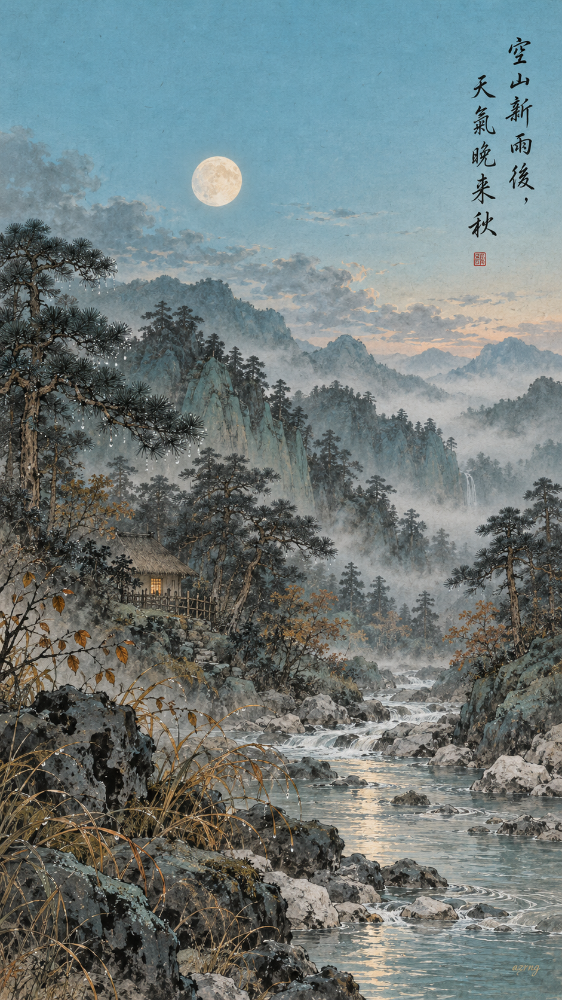
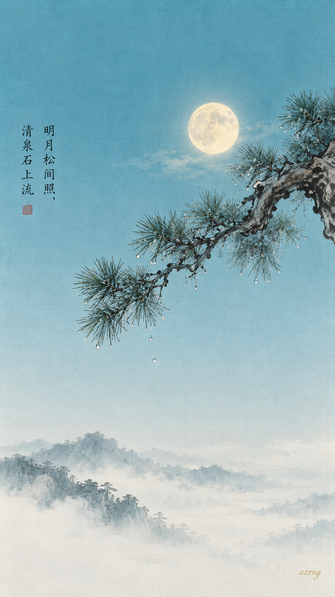
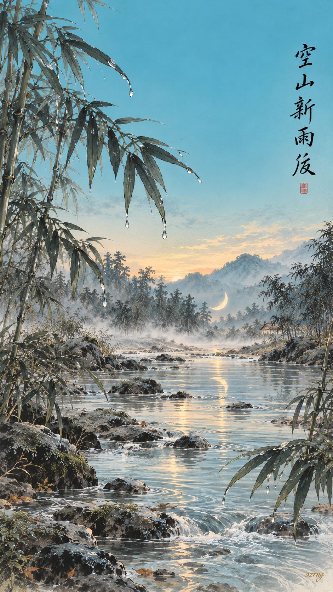
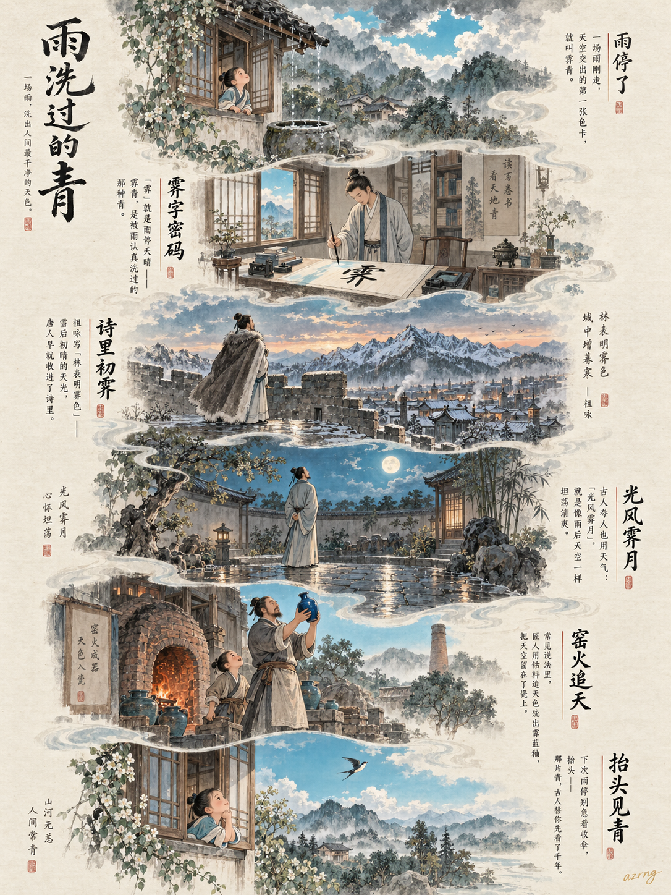
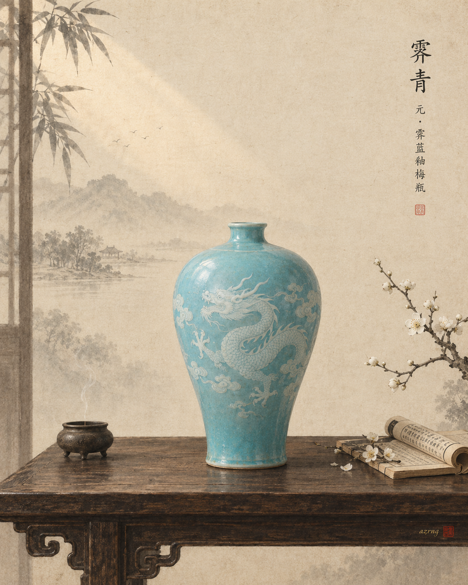
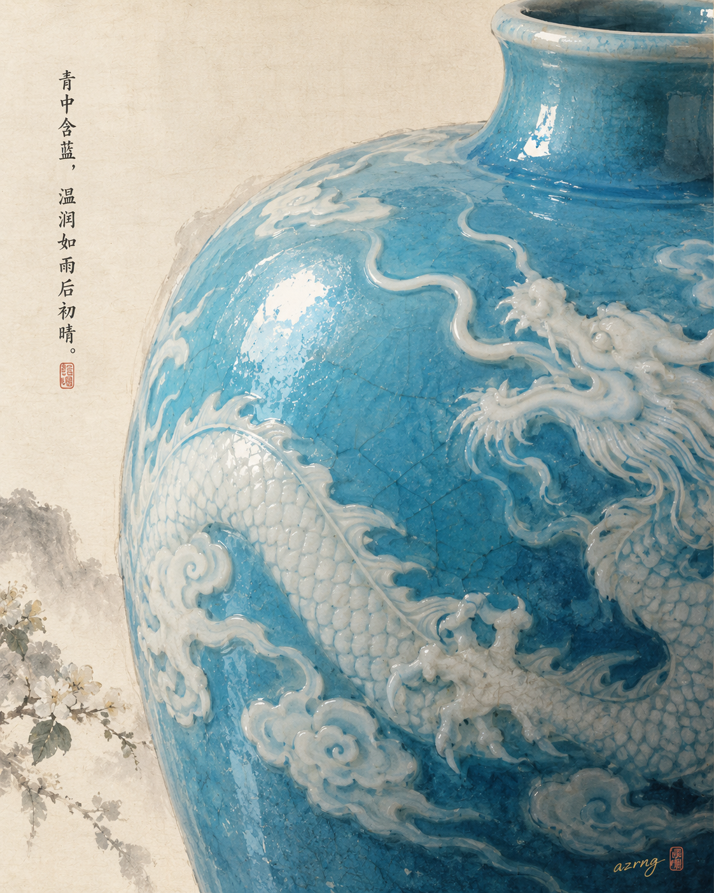
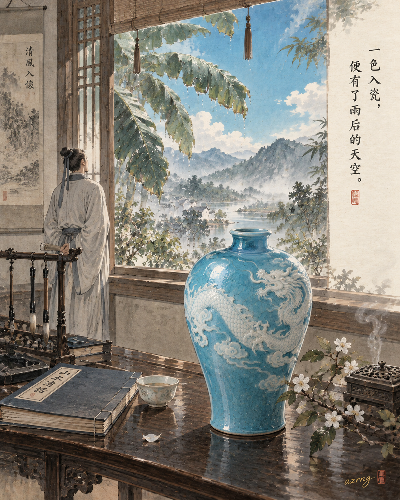

## 一色一诗

### 标题

《中国传统色｜霁青落进《山居秋暝》》

### 正文

如果《山居秋暝》有颜色，那一定是霁青——雨刚停，天空初晴时最干净的那一抹青。

霁青，因"色如雨后天空"而得名，是清代《景德镇陶录》里记载的官窑上品釉色。它比天青更沉一分，又比藏蓝透亮许多，落在秋山雨后，恰好是"空山新雨后，天气晚来秋"的清与静。

王维这首诗，写的本就是一场雨的尾声：明月照进松林，清泉漫过白石，暮色里竹喧莲动，莲叶轻晃处一叶渔舟。霁青是这一切的底色——澄澈、空灵、不着一尘。

三张壁纸，画了三种"雨霁"：

图一是新雨初歇的空山全景，明月已上松梢，山居亮起一盏灯；图二只取一松一月，把整片霁青长空留给你；图三推到天将明未明之际，落月沉进溪水，雨霁后的黎明最是干净。

三张里，你更喜欢哪一种雨后？

\#中国传统色 #霁青 #古诗词 #国风壁纸 #王维 #山居秋暝 #东方美学 #手机壁纸

## 一色一源

### 标题

中国传统色｜雨一停，天空就换上这件“霁青”

### 正文

如果天气有颜色，“雨停了”这三个字，一定叫霁青。

“霁”，专指雨雪停止、天色放晴。所以霁青不是随便调出来的蓝——它是雨刚走、云刚散，天空被认真洗过一遍之后的那种青。比蓝温柔，比灰明亮，干净得近乎透明。

唐人祖咏写“林表明霁色”，雪后初晴的天光成了千年名句；夸一个人品行坦荡，古人也说“光风霁月”——像雨后的风月一样清爽。瓷器里还有它的近亲霁蓝釉，匠人执着地想用窑火留住天空的颜色，一烧便是传世重器。

霁青，是古人抬头看见、低头就写进诗里的颜色。

下次雨停，别急着收伞。你抬头看到的那片青，古人已经替你看了上千年。

你那里的天空，最近一次“霁青”是什么时候？

\#中国传统色 #霁青 #东方美学 #国风插画 #古人的浪漫 #雨过天晴 #传统色博物志

## 一色一物

### 标题

中国传统色｜霁青，一只梅瓶里的雨后晴空

### 正文

有些颜色，要等一场雨停，才能看见。

霁青，就是雨过初晴时，天空被洗净的那一片青蓝。古人把雨止云散唤作"霁"，这片蓝，因此有了一个干净的名字。

想认识它，不妨去看一只瓶子——元代霁蓝釉白龙纹梅瓶，今藏扬州博物馆。小口短颈，丰肩敛腹，通体施蓝釉，一条白龙绕瓶而行。它呈现的釉色，与今天所说的霁青一脉相通。

霁蓝釉以钴为呈色剂，经千度以上高温一次烧成，釉面匀净失透，蓝得沉稳安静，像深海，也像刚放晴的天。在没有色卡的年代，古人把一片雨后晴空，稳稳烧进了瓷里。

所以霁青从不是色卡上孤零零的一块蓝。它盛过酒、供过案，还装着"海晏河清"的祈愿——愿河清海晏，四海承平。

下一期，你想看哪种颜色藏在哪件古物里？

\#中国传统色 #一色一物 #东方美学 #霁青 #霁蓝釉 #梅瓶 #中国古代瓷器 #文物之美